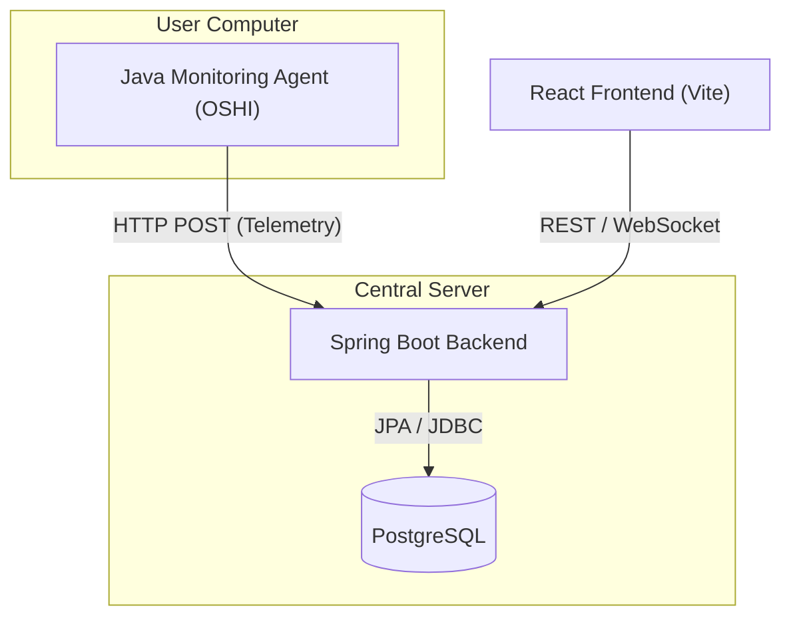

# Device Monitoring Architecture

This document describes the foundational architecture of the Device Monitoring system.

## High Level Architecture

## Component Details

### 1. Java Monitoring Agent
- **OSHI Collector**: Reads CPU, RAM, Disk, Battery, and Process metrics.
- **Resource Guard**: Monitors its own CPU and memory usage to ensure it doesn't cause system degradation.
- **Scheduler**: Periodically POSTs telemetry data to the backend.

### 2. Spring Boot Backend
- **Device & Permissions**: Manages registered devices and their local permission overrides.
- **Telemetry Ingestion**: Validates and stores incoming telemetry to PostgreSQL.
- **Diagnostics**: A deterministic, rule-based engine that evaluates telemetry (e.g. CPU > 90%). **This serves as the foundation for the future AI integration.**
- **Incident & Action Modules**: Entities to record anomalies and propose remediation actions.
- **WebSocket Layer**: Prepared for real-time dashboard data pushes.

### 3. Future AI Layer
The backend is designed cleanly to allow an AI layer to be injected.
- **ML / GenAI**: Will consume the deterministic Diagnostics output to generate `ActionRecommendations`.
- **RAG**: Will use historical `Incident` data to improve accuracy.
- **Agentic AI**: Will execute the `ActionRecommendations` on the device via the `device-monitoring-agent` once authorized.
